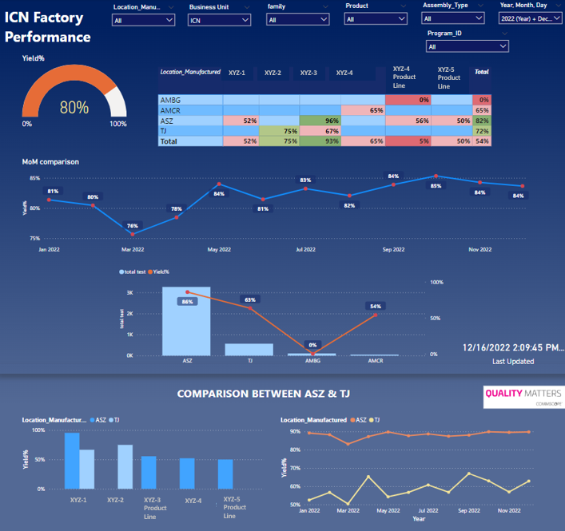
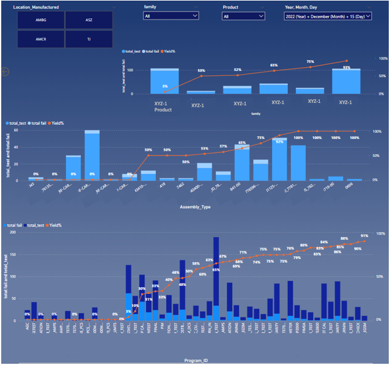
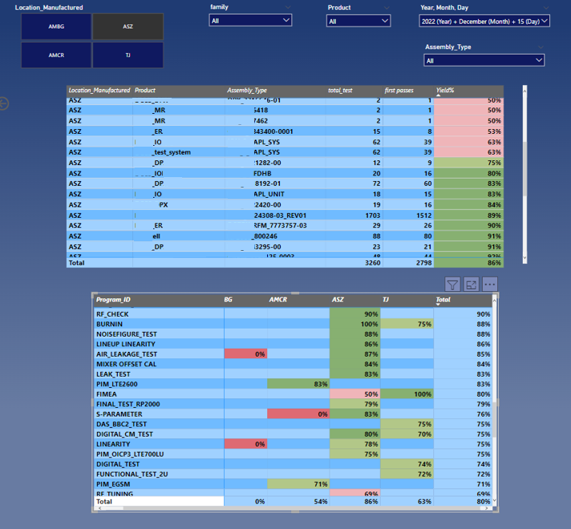

# CommScope-Yield Dashboard for all Product-Lines 

### Issue: 
  The manual process of collecting and analyzing data was a significant challenge for the global team of senior engineers/ NPI Engineers, as it made it difficult for them to gain visual insights and compare metrics from different locations. This could have led to a lack of understanding about the performance of different product lines and regions, as well as a lack of visibility into potential issues or opportunities for improvement  

### Impact: 
  By creating an automated system showing dashboard in Power BI and using direct queries within PowerBI to connect with the MQSQL Server database, the team was able to overcome these challenges and gain real-time visibility into key metrics. This allowed them to easily compare performance across different locations and product lines, identify areas of strength and weakness, and make informed decisions to improve efficiency and profitability.

### My learnings: 
  I worked with the global team to review and refine the dashboard, making updates and changes as needed based on their feedback. Once the dashboard was complete, I provided training to team members on how to use it and answered any questions they had. Overall, this was a challenging but rewarding project that allowed me to use my data analysis skills to help the global team better understand their product performance and make informed decisions which indeed saved a lot of manual hours.

### Metrics were tracked for these locations: 
China, Mexico, Germany, Czech Republic

### Dashboard:
Database for dashboard is MYSQL Server Database which is coonected with Power BI using direct query. The dashboard is hosted on a sharepoint site which updates daily to show the real-time analysis.

-----

 

 

-----

